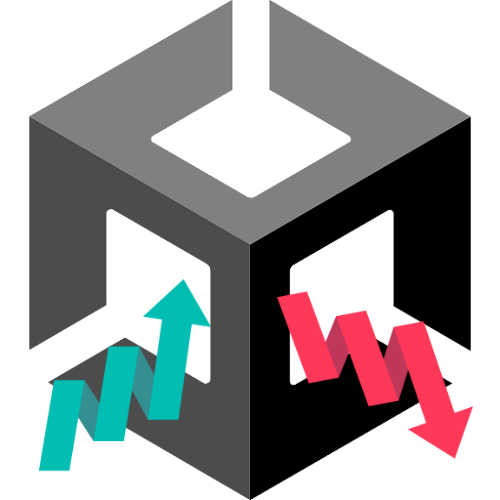
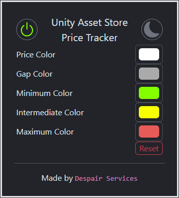
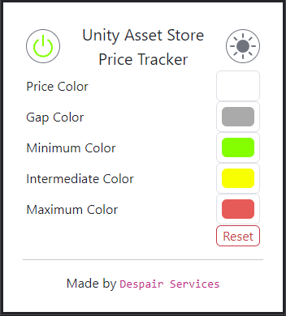
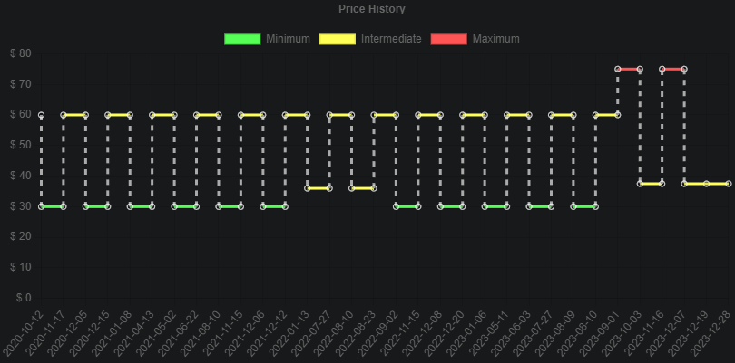

<!-- PROJECT LOGO -->
 

  
  <h2>Unity Asset Store Price Tracker</h3>
  
A chrome extension that lets you view pricing history for Unity assets

  

    
    
  

  

<!-- PROJECT SHIELDS -->

  
  
  
  
  

  

<!-- PROJECT SHOWCASE -->

  
  
  

<!-- ABOUT THE PROJECT -->
## About The Project

This project was made to remove the hassle of switching between the Unity Asset Store and any other site that tracks Unity asset pricing.
With that in mind, this chrome extension fetches and displays pricing history on the Unity Asset Store itself.

<!-- USAGE -->
## Usage

1.  Install the Chrome extension from the Chrome Web Store
2.  Modify the settings to your liking
3.  Navigate to the Unity Asset Store

<!-- CONTRIBUTING -->
## Contributing

If you have a suggestion that would make this better, please fork the repo and create a pull request.
You can also simply open an issue with the tag "enhancement".
Any contributions you make are **greatly appreciated**.

<!-- ACKNOWLEDGMENTS -->
## Acknowledgments

*   [Chrome Extension CLI](https://github.com/dutiyesh/chrome-extension-cli) for project bootstrap
*   [Bootstrap Icons](https://icons.getbootstrap.com/) for icons
*   [Shields.io](https://shields.io/) for badges
